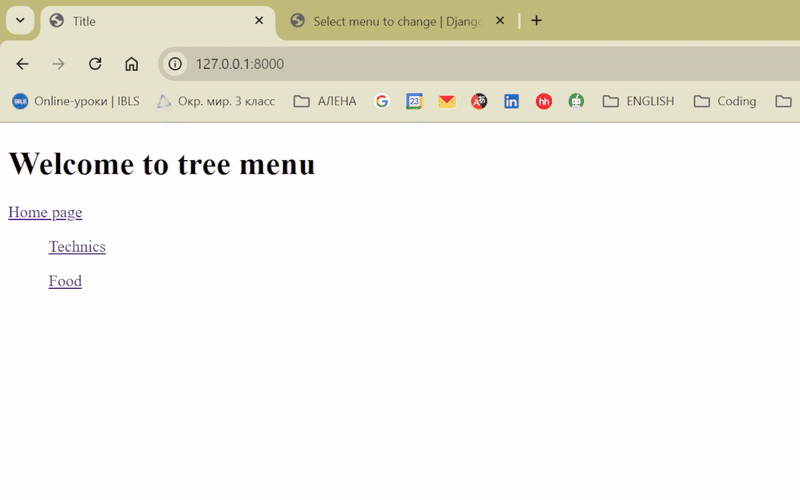
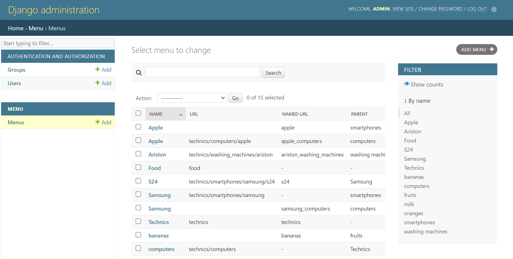

## Django-tree-menu
This is my implementation of the tree-structured menu, that can be added to any page via the custom template tag, such as  


### Features

- The menu is implemented via the custom template tag
- The menu items are stored in a database
- Items could be added or edited via admin panel
- The active menu item is detected based on current url
- Multiple menus can be rendered on a page via the template tag
- When you click on the menu item, you get redirected to its url. The url of the item can be defined both explicitly and by name
- Drawing one menu requires exactly one request to the database
- Only stadard Django library was used

### How to test

### Linux

```sh
git clone https://github.com/kitaef/django-tree-menu.git
python3 -m venv venv
source venv/bin/activate
pip install -r requirements.txt
cd tree
python3 manage.py runserver
```
### Windows
```sh
git clone https://github.com/kitaef/django-tree-menu.git
python -m venv venv
venv\Scripts\activate
pip install -r requirements.txt
cd tree
python manage.py runserver
```

I left the database, so you can test the menu with my items, or remove them from admin page. (user = admin, password = 1234)
